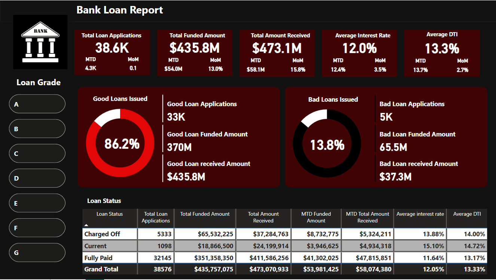

# Bank-Loan-Analysis

## 📌 Power BI Dashboard Overview  

This project analyzes **bank loan data** to understand total loan applications, total funded amount, total amount received, average interest rate and average DTI. Tile slicers is used for loan grade by which users can filter according to it and gain insights. Using **SQL, Power BI, and Excel**, we extract insights that help in financial decision-making.

## 🛠 Tools Used
- **SQL** → Data extraction & analysis  
- **Power BI** → Dashboard visualization  
- **Excel** → Data cleaning & preprocessing  
- **GitHub** → Project hosting  

## 📂 Dataset  
**Source**: Kaggle (Financial Loan Dataset)  
**Contains**: 
- Loan Applications, Total Funded Amount, Total Amount Received, Interest Rate and Borrower’s Debt-to-Income Ratio (DTI)
- Good loan Vs Bad loan issued
- Loan Status (Charged off, Current and Fully paid)

## 📊 Key Insights
**In Year 2021:**
1. **Total Loan Applications** → 38.6K loan applications were collected.  
2. **Total Funded Amount** → $435.8M amount was funded. 
3. **Total Amount Received** → $473.1M amount was received.
4. **Average Interest Rate** → 12.0% was the average interest rate.
5. **Average DTI** → 13.3% was the average Debt-to-Interest(DTI) ratio.

## 📜 Project Files
📁 **SQL/** → Contains all queries used for analysis  
📁 **PowerBI/** → Power BI report file (`.pbix`) & dashboard screenshots   

