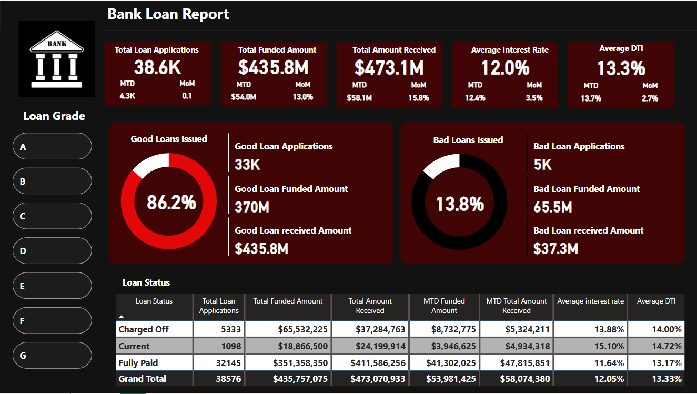

# Bank Loan Analysis

## Power BI Dashboard Overview  

This project analyzes **bank loan data** to understand total loan applications, total funded amount, total amount received, average interest rate, average DTI, loan status of the year 2021. Tile slicers is used for loan grade by which users can filter according to it and gain insights. Using Power BI, and Excel**, I extracted insights that can help in financial decision-making.

## 🛠 Tools Used
- **Power BI** → Dashboard visualization    
- **Excel** → Data cleaning & preprocessing  
- **GitHub** → Project hosting  

## 📂 Dataset  
**Source**: Kaggle (Financial Loan Dataset)  
**Contains**: 
- Id, Loan Amount, Total Payment, Interest Rate, Issue Date, Application Type
- Loan Status (Charged off, Current and Fully paid), loan grade

## 📊 Key Insights
**In Year 2021:**
1. **Total Loan Applications** → 38.6K loan applications were collected.  
2. **Total Funded Amount** → $435.8M amount was funded. 
3. **Total Amount Received** → $473.1M amount was received.
4. **Average Interest Rate** → 12.0% was the average interest rate.
5. **Average DTI** → 13.3% was the average Debt-to-Interest(DTI) ratio.

## 📜 Project Files
📁 **SQL/** → Contains all queries used for analysis  
📁 **PowerBI/** → Power BI report file (`.pbix`) & dashboard screenshots   

